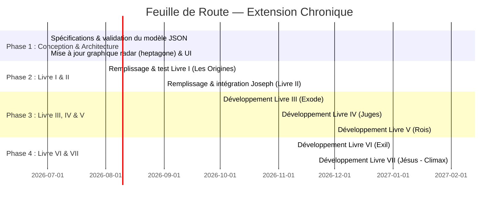

# Plan d'implémentation — Extension Chronologique "Chroniques Bibliques"

Ce document définit la structure narrative complète, l'architecture technique, le schéma de données JSON standardisé et la feuille de route de production pour étendre le jeu **Chroniques Bibliques** en une aventure continue composée de **7 Livres** chronologiques, d'Adam & Ève jusqu'à Jésus-Christ.

---

## 1. Structure Narrative Globale

L'ensemble des chapitres conçus forme une trame continue où le profil du joueur, son journal de sagesse et ses statistiques spirituelles sont partagés et préservés tout au long du jeu.

| Livre | Titre | Chapitres et Niveaux | Statut |
| :--- | :--- | :--- | :--- |
| **I** | **Les Origines** | 1. Adam & Ève (5 niveaux)<br>2. Hénoch (5 niveaux)<br>3. Noé (6 niveaux) | [book_1_origins.md](file:///C:/Users/sfort/.gemini/antigravity-ide/brain/c39c408b-8ea6-4f53-9716-2d04fd674ef2/book_1_origins.md) |
| **II** | **Les Patriarches** | 1. Abraham & Lot (5 niveaux)<br>2. Isaac (5 niveaux)<br>3. Jacob (5 niveaux)<br>4. **Joseph en Égypte** (7 niveaux - Existant) | [book_2_patriarchs.md](file:///C:/Users/sfort/.gemini/antigravity-ide/brain/c39c408b-8ea6-4f53-9716-2d04fd674ef2/book_2_patriarchs.md) |
| **III** | **L'Exode et la Conquête** | 1. Moïse (5 niveaux)<br>2. Josué (5 niveaux) | [book_3_exodus.md](file:///C:/Users/sfort/.gemini/antigravity-ide/brain/c39c408b-8ea6-4f53-9716-2d04fd674ef2/book_3_exodus.md) |
| **IV** | **Les Juges** | 1. Débora (5 niveaux)<br>2. Gédéon (5 niveaux)<br>3. Samson (5 niveaux) | [book_4_judges.md](file:///C:/Users/sfort/.gemini/antigravity-ide/brain/c39c408b-8ea6-4f53-9716-2d04fd674ef2/book_4_judges.md) |
| **V** | **Les Rois** | 1. Samuel & Saül (5 niveaux)<br>2. David (5 niveaux)<br>3. Salomon (5 niveaux) | [book_5_kings.md](file:///C:/Users/sfort/.gemini/antigravity-ide/brain/c39c408b-8ea6-4f53-9716-2d04fd674ef2/book_5_kings.md) |
| **VI** | **Les Prophètes et l'Exil** | 1. Élie (5 niveaux)<br>2. Esther (5 niveaux)<br>3. Daniel (5 niveaux) | [book_6_prophets.md](file:///C:/Users/sfort/.gemini/antigravity-ide/brain/c39c408b-8ea6-4f53-9716-2d04fd674ef2/book_6_prophets.md) |
| **VII** | **L'Accomplissement** | 1. Jean-Baptiste (5 niveaux)<br>2. Jésus - Nativité et Enfance (5 niveaux)<br>3. Jésus - Ministère et Paraboles (5 niveaux)<br>4. Jésus - Crucifixion et Résurrection (5 niveaux) | [book_7_fulfillment.md](file:///C:/Users/sfort/.gemini/antigravity-ide/brain/c39c408b-8ea6-4f53-9716-2d04fd674ef2/book_7_fulfillment.md) |

---

## 2. Évolution du Système de Statistiques (Heptagone)

Pour intégrer les dimensions de commandement et d'intégrité requises par les nouveaux récits, le jeu utilise 7 statistiques spirituelles. Le graphique radar SVG de l'onglet **Journal** de l'application sera mis à jour en un heptagone régulier (7 axes) :

- **Foi** (Angle de départ : -90° / 270° - Axe vertical haut)
- **Sagesse** (-90° + 51.4° = -38.6° / 321.4°)
- **Courage** (-38.6° + 51.4° = 12.8°)
- **Discernement** (12.8° + 51.4° = 64.2°)
- **Compassion** (64.2° + 51.4° = 115.6°)
- **Leadership** (115.6° + 51.4° = 167°)
- **Obéissance** (167° + 51.4° = 218.4°)

Formule de calcul des coordonnées du polygone `#radarShape` sur un repère centré en `(115, 105)` avec un rayon maximum de `85px` :
$$x = 115 + r \cdot \cos(\alpha)$$
$$y = 105 + r \cdot \sin(\alpha)$$

---

## 3. Architecture Technique Modulaire (JSON)

Toutes les données de jeu (Livres, chapitres, dialogues, énigmes, codex et traductions) sont regroupées dans un schéma JSON unique et modulaire.

```json
{
  "locale": "fr",
  "books": [
    {
      "bookId": 1,
      "title": {
        "fr": "Livre I : Les Origines",
        "en": "Book I: The Origins"
      },
      "chapters": [
        {
          "chapterId": "origins_adam_eve",
          "chapterNum": 1,
          "title": {
            "fr": "Adam & Ève",
            "en": "Adam & Eve"
          },
          "desc": {
            "fr": "La création, le choix et la première promesse.",
            "en": "Creation, choice and the first promise."
          },
          "levels": [
            {
              "levelNum": 1,
              "title": {
                "fr": "Le Jardin d'Éden",
                "en": "The Garden of Eden"
              },
              "location": {
                "fr": "Éden",
                "en": "Eden"
              },
              "partnerName": "Ève",
              "dialogues": [
                {
                  "speaker": "Narrateur",
                  "text": {
                    "fr": "L'Éternel plaça l'homme dans le jardin...",
                    "en": "The Lord placed man in the garden..."
                  }
                }
              ],
              "choices": [
                {
                  "text": {
                    "fr": "Prendre soin du jardin avec reconnaissance",
                    "en": "Take care of the garden with gratitude"
                  },
                  "stat": "Obéissance",
                  "val": 1
                }
              ],
              "puzzle": {
                "intro": {
                  "fr": "Remets les mots dans l'ordre...",
                  "en": "Put the words in order..."
                },
                "type": "word-order",
                "words": ["Car", "mon", "père"],
                "correct": ["Car", "mon", "père"]
              }
            }
          ]
        }
      ]
    }
  ]
}
```

---

## 4. Feuille de Route de Production (Roadmap)

Le déploiement des Livres s'effectue selon une logique chronologique et modulaire de manière à tester chaque brique narrative avant d'ouvrir la suivante.



### Jalons de déploiement (Milestones) :
- **Milestone A (Fin Mois 1)** : Moteur de rendu actualisé, support de 7 statistiques, structure de données compatible I18n.
- **Milestone B (Fin Mois 3)** : Livre I & II jouables en ligne avec persistence locale.
- **Milestone C (Fin Mois 6)** : Intégration complète de la période de l'Ancien Testament (Livres I à VI).
- **Milestone D (Fin Mois 8)** : Lancement du Livre VII (Nouveau Testament) et finalisation de la progression continue globale.
